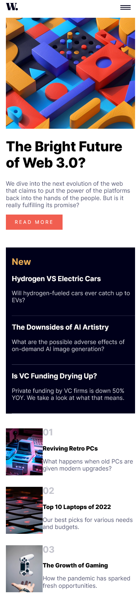
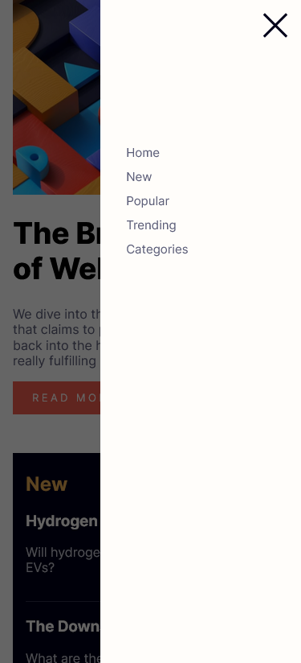
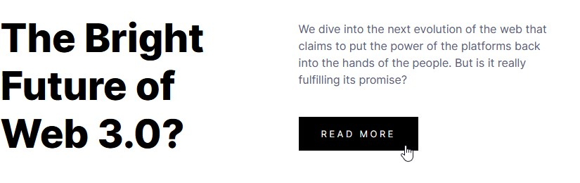
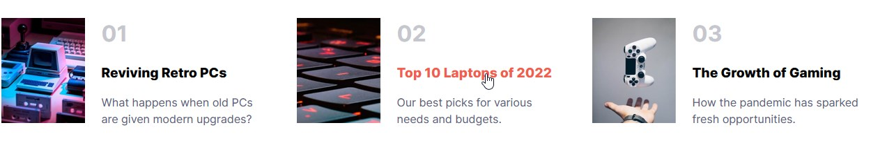

# Frontend Mentor - News homepage solution

This is a solution to the [News homepage challenge on Frontend Mentor](https://www.frontendmentor.io/challenges/news-homepage-H6SWTa1MFl). Frontend Mentor challenges help you improve your coding skills by building realistic projects. 

## Table of contents

- [Overview](#overview)
  - [The challenge](#the-challenge)
  - [Screenshot](#screenshot)
  - [Links](#links)
- [My process](#my-process)
  - [Built with](#built-with)
  - [What I learned](#what-i-learned)
- [Author](#author)
## Overview

### The challenge

Users should be able to:

- View the optimal layout for the interface depending on their device's screen size
- See hover and focus states for all interactive elements on the page

### Screenshot

## Desktop-View

## Mobile-View  

## navbar-list  

## Focus-parts

---

---

---

### Links

- Solution URL: [Add solution URL here](https://your-solution-url.com)
- Live Site URL: [Add live site URL here](https://your-live-site-url.com)

## My process

  - I've built up the skeleton for the website with HTML.
  - Styled most of the page's with CSS.
  - Applied Flexbox and Grid.
  - Used Mobile first pattern.
  - Started to use functionality and added brains using JavaScript.
  - Debugging process.
  - Finished the desktop verison.

### Built with

- Semantic HTML5 markup
- CSS custom properties
- Flexbox
- CSS Grid
- Mobile-first workflow
- Javascript

### What I learned

I've revised how to apply CSS grid and flexbox better than before.

## Author

- Website - [Github](https://github.com/amrmabdelazeem)
- Frontend Mentor - [@amrmabdelazeem](https://www.frontendmentor.io/profile/amrmabdelazeem)
